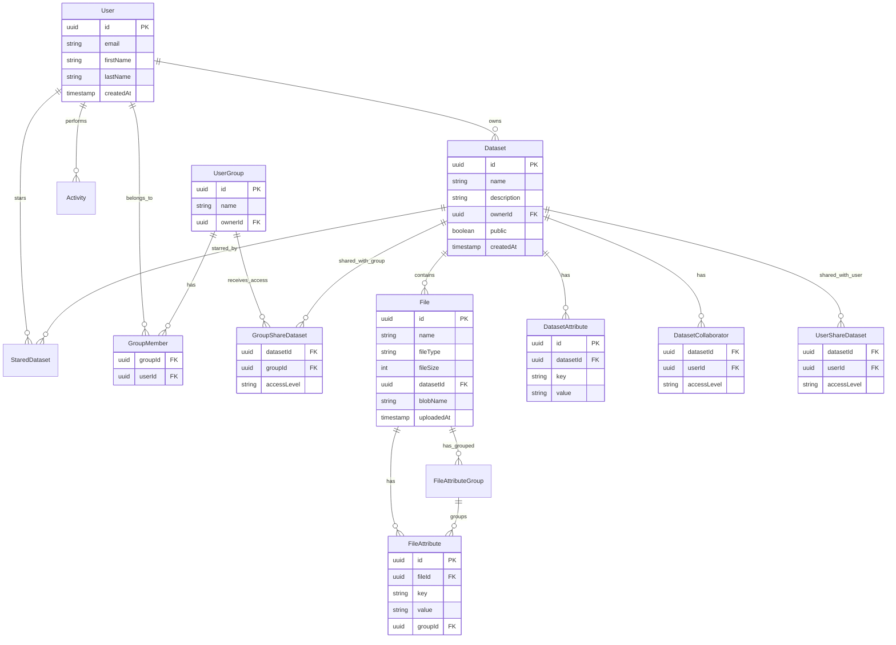

# LEMDAS - Leeds Electron Microscope Data Access System

[](https://classroom.github.com/open-in-codespaces?assignment_repo_id=13179005)

## Overview

LEMDAS (Leeds Electron Microscope Data Access System) is a comprehensive data management platform developed in collaboration with the University of Leeds Electron Microscope team (LEMAS). The system provides academics and researchers with a centralized solution for storing, sharing, and viewing electron microscope data, facilitating collaborative research and data accessibility across the scientific community.

### Key Features

- **Secure Data Storage**: Store microscope images and datasets with metadata extraction
- **Collaborative Sharing**: Share datasets with individual users or research groups
- **Advanced Search**: Search across datasets and files using metadata attributes
- **File Processing**: Automatic metadata extraction from DM3 and TIF microscope formats
- **Access Control**: Fine-grained permissions for datasets and files
- **Preview Generation**: Automatic generation of image previews for quick viewing

## Data Model



## Quick Start

### Prerequisites

- Node.js (v18+)
- Go (v1.21+)
- Python (v3.12+) with Poetry
- MySQL (v8.0+)
- Azure Storage Account (for blob storage)

### Environment Setup

Create `.env` files for each service with required variables:

```bash
# Database Configuration
DB_USERNAME=your_db_user
DB_PASSWORD=your_db_password
DB_NAME=lemdas
DB_HOST=localhost
DB_PORT=3306

# JWT Secret
JWT_SECRET=your_jwt_secret

# Azure Storage
AZURE_STORAGE_ACCOUNT=your_storage_account
AZURE_STORAGE_KEY=your_storage_key
```

### Running the Services

1. **Start MySQL Database**
   ```bash
   mysql.server start  # or use Docker
   ```

2. **Run Go Microservices**
   ```bash
   cd internal
   go mod download
   
   # Run each service in separate terminals
   go run auth/main.go
   go run webApi/main.go
   go run search/main.go
   go run upload/main.go
   ```

3. **Run Python File Processor**
   ```bash
   cd file_processor/fileProcessor
   poetry install
   poetry run uvicorn main:app --reload
   ```

4. **Run React Frontend**
   ```bash
   cd frontend
   npm install
   npm start
   ```

The application will be available at `http://localhost:3000`

## Architecture

LEMDAS uses a microservices architecture with:
- **Frontend**: React SPA for user interface
- **Auth Service**: JWT token management
- **Web API**: Core CRUD operations
- **Search Service**: Advanced search capabilities
- **Upload Service**: File upload/download with Azure Blob Storage
- **File Processor**: Python service for metadata extraction from microscope formats

## License

This project was developed as part of an academic collaboration with the University of Leeds.